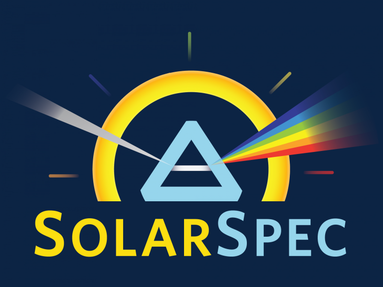

<div id="top"></div>

<!-- PROJECT SHIELDS -->
[![Contributors][contributors-shield]][contributors-url]
[![Forks][forks-shield]][forks-url]
[![Stargazers][stars-shield]][stars-url]
[![Issues][issues-shield]][issues-url]
[![MIT License][license-shield]][license-url]
[![LinkedIn][linkedin-shield]][linkedin-url]


<!-- PROJECT LOGO -->
<br />
<div align="center">
  <a href="https://github.com/SolarSpec/LoadTDMSfunctions">
    
  </a>

<h3 align="center">Functions for TDMS Files</h3>

  <p align="center">
    Base MATLAB functions for loading TDMS files with TAS/TAM data.
    <br />
    <a href="https://github.com/SolarSpec/LoadTDMSfunctions"><strong>Explore the docs »</strong></a>
    <br />
    <br />
    <a href="https://github.com/SolarSpec/LoadTDMSfunctions">View Demo</a>
    ·
    <a href="https://github.com/SolarSpec/LoadTDMSfunctions/issues">Report Bug</a>
    ·
    <a href="https://github.com/SolarSpec/LoadTDMSfunctions/issues">Request Feature</a>
  </p>
</div>


<!-- TABLE OF CONTENTS -->
<details>
  <summary>Table of Contents</summary>
  <ol>
    <li>
      <a href="#about-the-project">About The Project</a>
      <ul>
        <li><a href="#built-with">Built With</a></li>
      </ul>
    </li>
    <li>
      <a href="#getting-started">Getting Started</a>
      <ul>
        <li><a href="#prerequisites">Prerequisites</a></li>
        <li><a href="#installation">Installation</a></li>
      </ul>
    </li>
    <li><a href="#usage">Usage</a></li>
    <li><a href="#roadmap">Roadmap</a></li>
    <li><a href="#contributing">Contributing</a></li>
    <li><a href="#license">License</a></li>
    <li><a href="#contact">Contact</a></li>
    <li><a href="#acknowledgments">Acknowledgments</a></li>
  </ol>
</details>


<!-- ABOUT THE PROJECT -->
## About The Project
# LoadTDMSfunctions
Helper scripts to be able to load and navigate the TDMS data files generated by the TAM.

<p align="right">(<a href="#top">back to top</a>)</p>


### Built With

* [MATLAB](https://www.mathworks.com/products/matlab.html)
* [TDMS Reader Addon](https://www.mathworks.com/matlabcentral/fileexchange/30023-tdms-reader)
<!-- * [Image Processing Toolbox](https://www.mathworks.com/help/images/)
* [Curve Fitting Toolbox](https://www.mathworks.com/help/curvefit/) -->

<p align="right">(<a href="#top">back to top</a>)</p>


<!-- GETTING STARTED -->
## Getting Started

Use the following scripts depending on the task you are trying to accomplish:

### Prerequisites

Make sure MATLAB is installed. It is available for download in the Software Distribution section under the Help tab after you log into [Canvas.](https://canvas.ubc.ca/)


### Installation

1. Clone the repo to your PC
   ```sh
   git clone https://github.com/SolarSpec/LoadTDMSfunctions.git
   ```
2. Open the appropriate script
   ```
   Click on the .m file in your repository to open and edit
   ```
3. Run the script
   ```
   Click on Run in the 'Editor' header at the top of the MATLAB application
   ```

<p align="right">(<a href="#top">back to top</a>)</p>


<!-- USAGE EXAMPLES -->
## Usage

<!-- Here is a simple example of the app used on a small dataset. The filtering is turned on and we'd like to export all the kinetics data by clicking the "Export CSV Data" button. We can view where the file was saved in the text on the left panel and can then open the CSV file to view the data.

_Please note that the bottom of each CSV contains an extra row of information attributed to the BackgroundLevel data of each TDMS file. This is simply a convention to carry this data if it is loaded back into the PIAS app. If one does not intend to load it back into the app, you may delete this row or store the variables somewhere else in the CSV as to not lose it for future use._

  <div class="row">
    
  </div>
  <div class="row" style="float:left">
    
  </div>


_For more information on data filtering and decimation, please refer to the [Documentation](https://www.mathworks.com/help/signal/ref/decimate.html#d123e21788)_ -->

<p align="right">(<a href="#top">back to top</a>)</p>

<!-- ROADMAP -->
## Roadmap

- [X] Load multiple TDMS files
- [X] Calculate ABS from TDMS
  - [X] Import ABS from TDMS
- [X] Import raw A and B trace
- [X] Calculate logarithm data from linear data
- [X] Calculate logarithm spaced data from linear data

See the [open issues](https://github.com/SolarSpec/LoadTDMSfunctions/issues) for a full list of proposed features (and known issues).

<p align="right">(<a href="#top">back to top</a>)</p>

<!-- CONTRIBUTING -->
## Contributing

Contributions are what make the open source community such an amazing place to learn, inspire, and create. Any contributions you make are **greatly appreciated**.

If you have a suggestion that would make this better, please fork the repo and create a pull request. You can also simply open an issue with the tag "enhancement".
Don't forget to give the project a star! Thanks again!

1. Fork the Project
2. Create your Feature Branch (`git checkout -b feature/AmazingFeature`)
3. Commit your Changes (`git commit -m 'Add some AmazingFeature'`)
4. Push to the Branch (`git push origin feature/AmazingFeature`)
5. Open a Pull Request

<p align="right">(<a href="#top">back to top</a>)</p>

<!-- LICENSE -->
## License

Distributed under the BSD 3-Clause License. See `LICENSE.txt` for more information.

<p align="right">(<a href="#top">back to top</a>)</p>

<!-- CONTACT -->
## Contact

SolarSpec - [SolarSpec Website](https://solarspec.ok.ubc.ca/) - vidihari@student.ubc.ca

Project Link: [https://github.com/SolarSpec/LoadTDMSfunctions](https://github.com/SolarSpec/LoadTDMSfunctions)

<p align="right">(<a href="#top">back to top</a>)</p>

<!-- ACKNOWLEDGMENTS -->
## Acknowledgments

* [Group Leader - Dr. Robert Godin](https://solarspec.ok.ubc.ca/people/)
* [The Entire SolarSpec Team](https://solarspec.ok.ubc.ca/people/)

<p align="right">(<a href="#top">back to top</a>)</p>

<!-- MARKDOWN LINKS & IMAGES -->
<!-- https://www.markdownguide.org/basic-syntax/#reference-style-links -->
[contributors-shield]: https://img.shields.io/github/contributors/SolarSpec/LoadTDMSfunctions.svg?style=for-the-badge
[contributors-url]: https://github.com/SolarSpec/LoadTDMSfunctions/graphs/contributors
[forks-shield]: https://img.shields.io/github/forks/SolarSpec/LoadTDMSfunctions.svg?style=for-the-badge
[forks-url]: https://github.com/SolarSpec/LoadTDMSfunctions/network/members
[stars-shield]: https://img.shields.io/github/stars/SolarSpec/LoadTDMSfunctions.svg?style=for-the-badge
[stars-url]: https://github.com/SolarSpec/LoadTDMSfunctions/stargazers
[issues-shield]: https://img.shields.io/github/issues/SolarSpec/LoadTDMSfunctions.svg?style=for-the-badge
[issues-url]: https://github.com/SolarSpec/LoadTDMSfunctions/issues
[license-shield]: https://img.shields.io/github/license/SolarSpec/LoadTDMSfunctions.svg?style=for-the-badge
[license-url]: https://github.com/SolarSpec/LoadTDMSfunctions/blob/main/LICENSE.txt
[linkedin-shield]: https://img.shields.io/badge/-LinkedIn-black.svg?style=for-the-badge&logo=linkedin&colorB=555
[linkedin-url]: https://linkedin.com/in/haris-vidimlic-06730019b/
[product-screenshot]: LoadTDMSfunctions_resources/Screenshot.png
